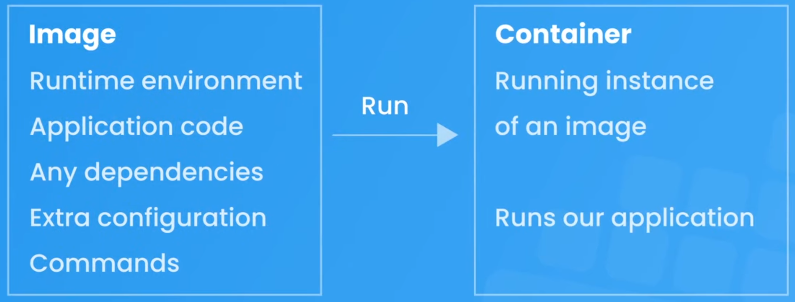
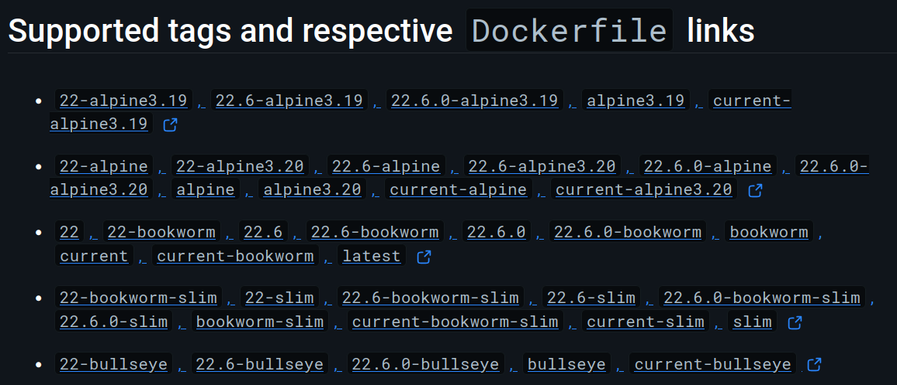

# 1. What is Docker?

Docker is a platform that enables developers to automate the deployment of applications inside lightweight, portable containers. These containers include everything needed to run the app, such as code, libraries, and dependencies, ensuring consistency across different environments. Docker simplifies development, testing, and deployment by allowing applications to run reliably in various settings, from local machines to cloud servers.

# 2. Installing Docker

https://docs.docker.com/engine/install/

# 3. Images & Containers

### 3.1. Images

Images are like blueprints for containers, containing every single thing your application needs to run, like:

- Runtime environment
- Application code
- Dependencies
- Extra configuration (e.g. environment variables)
- Commands (e.g. npm install)
  
###### Images are read-only

Once you create an image, it can't be changed. If you need to change something in the image, you'll need to create a brand new image to incorporate the changes.

### 3.2. Containers

Containers are runnable instances of images.

*Figure 1: images & containers.*

###### Containers are isolated processes

Containers run independtly from any other processes on your machine, packaged with anything they need to run inside of it, completely isolated from everything else.

###### Containers are easily shareable

Given the isolated nature of containers, they can run in any machine with support for Docker, without a need for setting up any dependencies by hand - which makes your application easily reproductable between different machines.

# 4. Parent images & Docker Hub

###### Images are made up from different layers

Images are built bottom-up from different layers, where wach layer adds something else for the image incrementally. The order of the layers is key for the image building process.

### 4.1. Parent image

The first layer of an image container is the <b>parent image</b>, which contains the operating system and runtime environment of your application.

### 4.2. DockerHub

DockerHub is an online repository of Docker images, containing a collection of pre-made parent images that can be used as the parent layer of your images.

https://hub.docker.com/

Take a look, for example, at the official Node.js image for Docker containers: https://hub.docker.com/_/node
This image can be downloaded using the command `docker pull node`

###### Use tags to specify versions and OS distributions

There are differents tags that can be used to specify variations of the parent image, such as its version and undelying OS distribution.

It is always beneficial to specify these tags, otherwise Docker will download the latest version of your dependencies by default - which can potentially break your application as a whole.

*Figure 2: Tags used for Node applications.*

# 5. The Dockerfile
