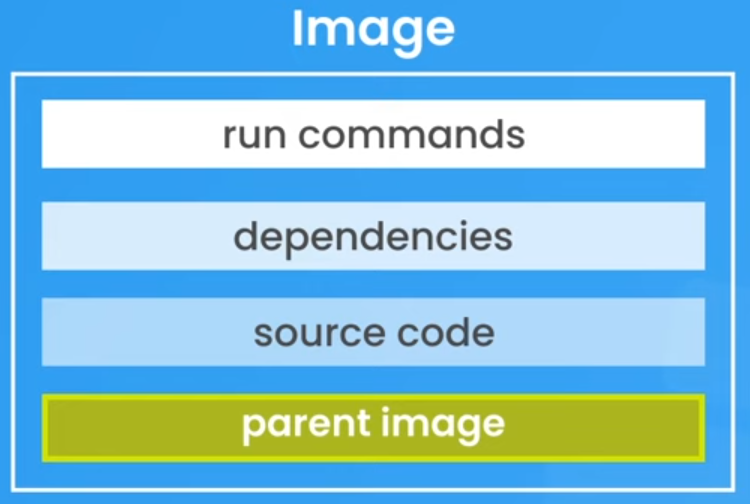
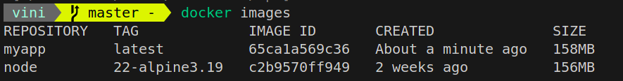

# 1. What is Docker?

Docker is a platform that enables developers to automate the deployment of applications inside lightweight, portable containers. These containers include everything needed to run the app, such as code, libraries, and dependencies, ensuring consistency across different environments. Docker simplifies development, testing, and deployment by allowing applications to run reliably in various settings, from local machines to cloud servers.

# 2. Installing Docker

https://docs.docker.com/engine/install/


# 3. Images & Containers

### 3.1. Images

Images are like blueprints for containers, containing every single thing your application needs to run, like:

- Runtime environment
- Application code
- Dependencies
- Extra configuration (e.g. environment variables)
- Commands (e.g. npm install)
  
###### Images are read-only

Once you create an image, it can't be changed. If you need to change something in the image, you'll need to create a brand new image to incorporate the changes.


### 3.2. Containers

Containers are runnable instances of images.


###### Containers are isolated processes

Containers run independtly from any other processes on your machine, packaged with anything they need to run inside of it, completely isolated from everything else.

###### Containers are easily shareable

Given the isolated nature of containers, they can run in any machine with support for Docker, without a need for setting up any dependencies by hand - which makes your application easily reproductable between different machines.

# 4. Parent images & Docker Hub

###### Images are made up from different layers

Images are built bottom-up from different layers, where wach layer adds something else for the image incrementally. The order of the layers is key for the image building process.

### 4.1. Parent image

The first layer of an image container is the <b>parent image</b>, which contains the operating system and runtime environment of your application.




### 4.2. DockerHub

DockerHub is an online repository of Docker images, containing a collection of pre-made parent images that can be used as the parent layer of your images.

https://hub.docker.com/

Take a look, for example, at the official Node.js image for Docker containers: https://hub.docker.com/_/node
This image can be downloaded using the command `docker pull node`

###### Use tags to specify versions and OS distributions

There are differents tags that can be used to specify variations of the parent image, such as its version and undelying OS distribution.

It is always beneficial to specify these tags, otherwise Docker will download the latest version of your dependencies by default - which can potentially break your application as a whole.


# 5. Dockerfile

To create a Docker image, you must use a <b>Dockerfile</b>, which is a set of instructions that Docker will use for the creation of your image.

The commands will be executed bottom-up, constructing the layers of the image one layer at a time. Let's create an image for a node application.
First, we have this simple folder structure in our machine:

.<br/>
├── app.js<br/>
├── Dockerfile<br/>
├── package.json<br/>
└── package-lock.json<br/>

In the Dockerfile, the first line will specify the runtime environment and OS distribution of our app:

1. ```FROM node:22-alpine3.19```

So far we have an alpine3.19 linux distribution with node22 installed in it. Sweet, but it's all empty.
Let's create a work directory inside the image's root directory...

2. ```WORKDIR /app```

The next operations will be executed relativily to the work directory.
This folder is empty. Let's copy our files into it.

3. ```COPY . .```

The first parameter is the relative path to the directory we wanna copy our source files from - in this case, Dockerfile is in the same directory as the source files (a dot).
The second parameter is the relative path inside the work directory (`/app`) that we want to copy our source code to.

We can use `RUN` to setup terminal commands and Docker will execute them at build time in the work directory.

4. ```RUN npm install```

Next, we can expose the container's port to the external user. Although our node app may use a port in it, these are <i>not</i> the same port. Docker will use this port to make a port mapping.

1. ```EXPOSE 4000```

If you want to actually start the server, keep in mind that `RUN` is executed at build time, not at run time. For that, we should use

6. ```CMD ["node","app.js"]```

Let's set a clear distinction between these two:

> RUN: Executes commands in a new layer on top of the current image and commits the result. 

> CMD: Specifies the default command to run when a container starts from the built image. 

All set, we can now build the image in our machine with `docker build` giving it a title and relative path.

@ /api/
```docker build -t myapp .```

With this your image should be built. Check it with
```docker images```



# 6. dockerignore

In our machine, we might have node_modules installed for dev mode.
When we run `COPY . .` in the Dockerfile, node_modules should be ignored. For Docker to ignore this and any other files/folders, like environment variables or sensitive data. For that, create a file called `.dockerignore`. It works similarly to a `.gitignore` file, but there's some crucial syntax differences, so be sure to look at the docs for more details.

# 7. Starting & stoping containers

Now we can build our image and start its container.

> (build image) `docker build -t <image_name>:<tag> <path>`
> (start container) `docker run -d -p <host_port>:<container_port> --name <container_name> <image_name>:<tag>`
> (stop container) `docker stop <container_name_or_id>`
> -t: tag
> -d: detached
> -p: port-mapping

For further commands, check section 9.

# 8. Layer caching

Docker will cache the image layers on top of one another, so if something changes on the N-th layer of an image, all the previous (N-1)-th layers will remain cached at build time. This will increase the build procedure perfomance by only rebuilding the layers after the change.
So far, our Dockerfile looks like this:

```
FROM node:22-alpine3.19
WORKDIR /app
COPY . .
RUN npm install
EXPOSE 4000
CMD ["node","app.js"]
```

Notice that any change in the source code will re-trigger `npm install`. This bottleneck can be corrected by adjusting the sequence of events in the Dockerfile, placing the source code after package installations.

```
FROM node:22-alpine3.19
WORKDIR /app
COPY package.json .
RUN npm install
COPY . .
EXPOSE 4000
CMD ["node","app.js"]
```

By doing this, changes in the source code will lead to a faster rebuild time.

# 9. Managing images & Containers

Here's a list of useful commands to manage images and containers from terminal:

> ___
> (list images) `docker images -a`
> 
> (build image) `docker build -t <image_name>:<tag> <path>`
> 
> (remove image) `docker rmi <image_name>:<tag>`
> 
> (remove all images) `docker rmi $(docker images -q)`
> 
> (list running containers) `docker ps`
> 
> (list all containers) `docker ps -a`
> 
> (start container) `docker run -d -p <host_port>:<container_port> --name <container_name> <image_name>:<tag>`
> 
> (stop container) `docker stop <container_name_or_id>`
> 
> (delete container) `docker rm <container_name>`
> 
> (delete all containers) `docker rm -f $(docker ps -a -q)`
> 
> 
> -a: all
> -t: tag
> -d: detached
> -p: port-mapping
> -q: quiet
> -f: force
> ___

Also, there's one powerful and dangerous command that can be quite useful:

> `docker system prune -a`

This command removes all unused Docker objects, including stopped containers, unused networks, dangling images (images not referenced by any container), and build cache. Adding the -a flag extends the cleanup to also remove unused images, not just dangling ones.

